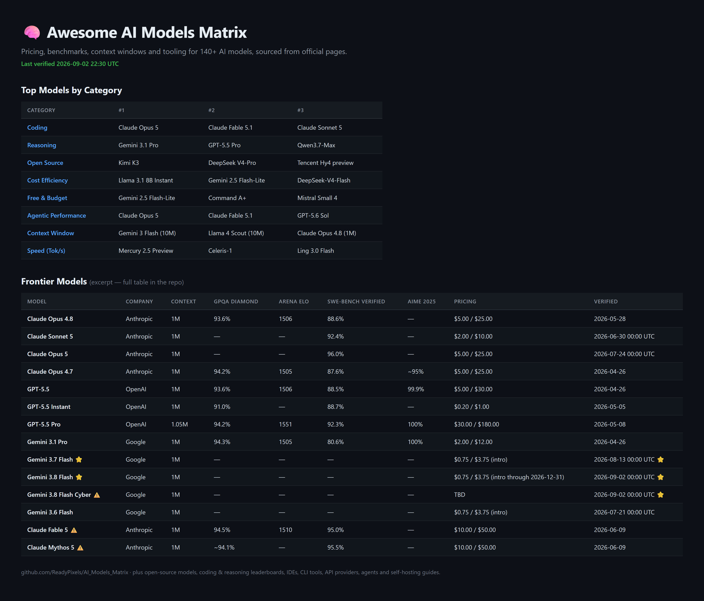

  

# Awesome AI Models Matrix 🧠

> A sourced comparison of 140+ AI models and the tools around them: pricing, context windows, benchmark scores, IDEs, CLI agents, API providers and self-hosting requirements. Every number links back to the official page it came from.

**➡️ [Open the full matrix](docs/readme.md)**

  

---

## Last verified

**2026-09-02 22:30 UTC** (document version 3.52)

That date is the last time every pricing figure, benchmark score and version number in the matrix was re-checked against its primary source. It's the same timestamp carried in the document header, so the badge above and the data never drift apart. Anything changed in the last 30 days is flagged with ⭐.

## How it's kept current

- **Cadence**: a full refresh every one to two weeks, plus a same-week entry whenever a major lab ships something. See <a href="docs/CHANGELOG.md" rel="nofollow">CHANGELOG.md</a> for the dated history.
- **Scope of a refresh**: all 71 tracked sections get re-checked in each pass, not only the ones with obvious news. A section that hasn't changed still gets confirmed.
- **Sourcing order**: official company sites and API docs first, then official GitHub repos and press releases, then model cards from verified Hugging Face orgs, then papers from the model's own authors. Major tech press is a last resort and gets labelled as such.
- **What doesn't go in**: announced-but-unreleased models, benchmark numbers nobody published, and unofficial model names. Estimates are marked with `~`, and missing data stays as `—` rather than getting filled in with a guess.
- **Every row carries a verified date** so you can see how stale any single entry is instead of trusting one banner at the top.

## Found something wrong?

Corrections are the most useful contribution here, and they're quick to file.

- <a href="https://github.com/ReadyPixels/AI_Models_Matrix/issues/new" rel="nofollow">Open an issue</a> with the row and a link to the official source that contradicts it.
- Or send a pull request against `docs/readme.md`. <a href="CONTRIBUTING.md" rel="nofollow">CONTRIBUTING.md</a> covers the table formats and the one-entry-one-section rule.

Either way, include the primary source. A claim without a link can't be merged.

## What's inside

| Section | Covers |
|---------|--------|
| <a href="docs/readme.md#models-" rel="nofollow">Models</a> | Frontier, open-source, coding, reasoning and multimodal models; pricing, context, output limits, cutoffs, regional availability, hardware requirements |
| <a href="docs/readme.md#development-tools-️" rel="nofollow">Development Tools</a> | Agentic IDEs, VS Code forks, CLI coding agents, IDE add-ons, API providers, GPU and inference clouds |
| <a href="docs/readme.md#automation-" rel="nofollow">Automation</a> | AI browsers, browser-automation libraries, computer-use agents, multi-agent platforms, model routers |
| <a href="docs/readme.md#ai-infrastructure-️" rel="nofollow">AI Infrastructure</a> | Embeddings and rerankers, video generation, TTS and STT, guardrails, RAG, fine-tuning, evals, MCP servers |
| <a href="docs/readme.md#guides-" rel="nofollow">Guides</a> | Model picks by task, free APIs for coding, free vibe-coding platforms, Ollama self-hosting |

## License

Licensed under <a href="https://creativecommons.org/licenses/by/4.0/" rel="nofollow">CC BY 4.0</a>. Copy it, fork it, republish it, build a product on it. Just credit this repository.

---

Maintained by ReadyPixels LLC · <a href="https://github.com/ReadyPixels/AI_Models_Matrix" rel="nofollow">github.com/ReadyPixels/AI_Models_Matrix</a>
